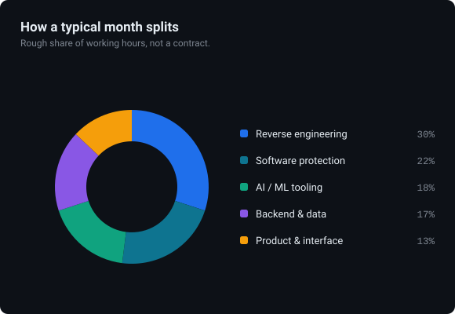
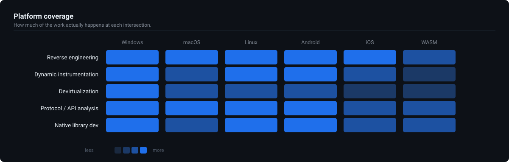
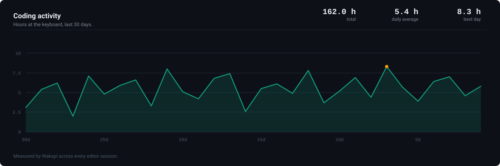
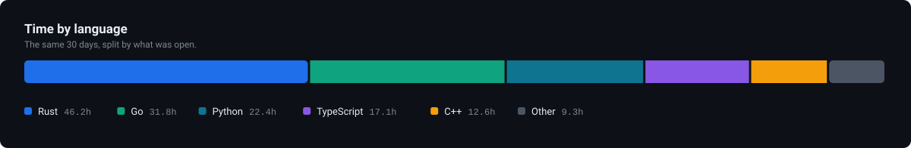
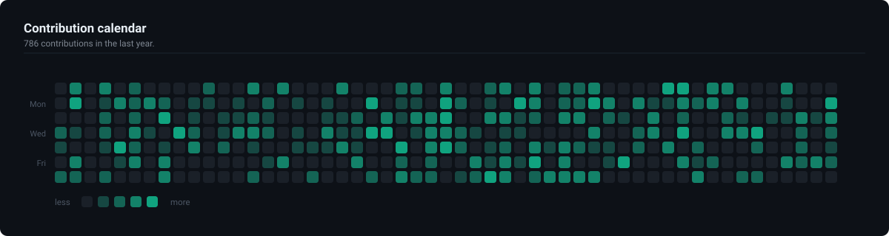

# Hi there, I'm Ravikash

> **Renaissance-class offensive security researcher with demonstrated global top-tier depth in multiple rare niches and shipped production engineering capability.**

## About Me

I work across **cybersecurity**, **AI/ML**, **software protection**, and **blockchain** — with a focus on problems that demand both depth and breadth. My core work spans reverse engineering and binary analysis across Windows, macOS, Linux, Android, and iOS; software protection research on commercial protectors and virtualization systems; mobile application security including native library analysis and runtime instrumentation; and API protocol analysis with authentication internals and anti-bot research.

Beyond security, I build AI-powered products, real-time data pipelines, developer tools, and scalable backend systems. My work spans from native code and assembly-level analysis to full-stack product development — I'm comfortable anywhere on the stack, and most drawn to hard engineering problems where the interesting answers live below the surface.

I'm open to serious collaboration around **security consulting**, **software protection engineering**, **AI/ML tooling**, **data infrastructure**, and **developer automation**.

## Where the Work Goes

  <picture>
    <source media="(prefers-color-scheme: dark)" srcset="./profile/skills-radar-dark.svg" />
    <source media="(prefers-color-scheme: light)" srcset="./profile/skills-radar-light.svg" />
    
  </picture>
  <picture>
    <source media="(prefers-color-scheme: dark)" srcset="./profile/skills-focus-dark.svg" />
    <source media="(prefers-color-scheme: light)" srcset="./profile/skills-focus-light.svg" />
    
  </picture>

## Languages

  <picture>
    <source media="(prefers-color-scheme: dark)" srcset="./profile/skills-langs-dark.svg" />
    <source media="(prefers-color-scheme: light)" srcset="./profile/skills-langs-light.svg" />
    
  </picture>

## Platform Coverage

  <picture>
    <source media="(prefers-color-scheme: dark)" srcset="./profile/skills-platforms-dark.svg" />
    <source media="(prefers-color-scheme: light)" srcset="./profile/skills-platforms-light.svg" />
    
  </picture>

## Coding Activity

  <picture>
    <source media="(prefers-color-scheme: dark)" srcset="./profile/activity-hours-dark.svg" />
    <source media="(prefers-color-scheme: light)" srcset="./profile/activity-hours-light.svg" />
    
  </picture>

  <picture>
    <source media="(prefers-color-scheme: dark)" srcset="./profile/activity-langs-dark.svg" />
    <source media="(prefers-color-scheme: light)" srcset="./profile/activity-langs-light.svg" />
    
  </picture>

## Git Status

  <picture>
    <source media="(prefers-color-scheme: dark)" srcset="./profile/git-year-dark.svg" />
    <source media="(prefers-color-scheme: light)" srcset="./profile/git-year-light.svg" />
    
  </picture>

  <picture>
    <source media="(prefers-color-scheme: dark)" srcset="./profile/git-heatmap-dark.svg" />
    <source media="(prefers-color-scheme: light)" srcset="./profile/git-heatmap-light.svg" />
    
  </picture>

## Toolchain

The software I actually have open, and what I build on top of.

| | |
|---|---|
| **Analysis** | IDA Pro · Ghidra · Binary Ninja · x64dbg · LLDB · Hopper · Frida · Wireshark |
| **Backend** | Node.js · NestJS · Express · FastAPI · Flask · Django · .NET · GraphQL |
| **Frontend** | React · Next.js · React Native · Flutter · Tailwind · Vite · Webpack |
| **Data** | PostgreSQL · MongoDB · Redis · SQLite · MySQL · Cassandra · Elasticsearch · Snowflake |
| **Infra** | Docker · Linux · Nginx · Cloudflare Workers · AWS · Azure · Google Cloud |

## Selected Work

- [watchman](https://github.com/incordai/watchman) — local-first memory, governance, and code-audit engine for AI agents.

## Let's Connect

[Repositories](https://github.com/blockmandev?tab=repositories) · [Gists](https://gist.github.com/blockmandev) · on GitHub since October 2017

<!--
Charts are generated locally — no third-party image services.
  python3 fetch_data.py     # pulls GitHub + Wakapi numbers into data.json
  python3 make_charts.py    # renders profile/*.svg in dark and light
.github/workflows/charts.yml runs both daily.
-->
